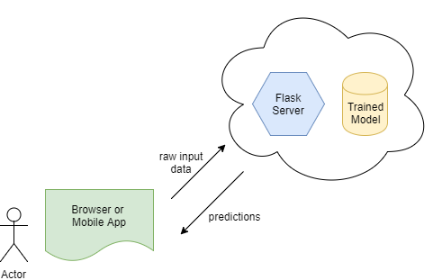

## Web Deployment of Machine Learning Model

Here is a simple example illustrating how a trained Machine Learning model can be deployed in the backend of a web server.



Using the browser or a mobile app, a user sends raw input data to the web application (running on a Flask server, for example). The web application queries the trained model, gets predictions, and returns the results back to the user.

## Setup
```
pip install Flask
```

## Generate model
```
pushd ..
python sklearn_example.train.py
popd
```

## Run
```
python myapp.py
```

Go to http://127.0.0.1:5000 from your browser.

Code Layout:
* myapp.py: a simple Flask application. This supports a POST and GET request to a form that receives user input. Note that this form is just an example of one way to receive input. A more automated way is to define a REST API that receives the input in JSON format. 
* models.py: a python class that loads a pre-trained model (trained using sklearn_example.train.py in the parent folder), and uses the model to perform predictions.

## References
- http://flask.pocoo.org/docs/1.0/quickstart/
- https://scotch.io/bar-talk/processing-incoming-request-data-in-flask
- http://jinja.pocoo.org/